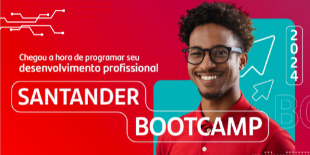

  

# Santander Bootcamp 2024
Este repositório contém os códigos desenvolvidos durante a trilha de Back-end com Java do Santander Bootcamp 2024, realizado em parceria com a DIO.

## 📌 Índice
- [Estrutura do Bootcamp](#estrutura-do-bootcamp)
- [Estrutura do Repositório](#estrutura-do-repositório)
- [Tecnologias e Ferramenta utilizadas](#tecnologia-e-ferramenta-utilizadas)
- [Autor](#-autor)

 

## Estrutura do Bootcamp
O Bootcamp é dividido em 7 etapas, com foco em desenvolvimento de software. 

Etapas:
1. Princípios de Desenvolvimento de Software Colaborativo
2. Dominando a Linguagem de Programação Java
3. Programação Orientada a Objetos com Java
4. Testes e Gerenciamento de Dependências em Projetos Java
5. Banco de Dados SQL e NoSQL Para Desenvolvedores Back-end
6. Ganhando Produtividade no Java com Spring Framework
7. Soft Skills na Era Ágil: Conectando Pessoas e Oportunidades

 
Obs.: Nem todas as etapas possuem projetos a serem enviados.

## Estrutura do Repositório
Este repositório está organizado por etapa, com pastas separadas para cada uma. Dentro de cada pasta, você encontrará os códigos desenvolvidos para os desafios da etapa, divididos em arquivos separados.

## Tecnologia e Ferramenta utilizadas

 

## 📝 Autor

- Isabela Maria Leonardo